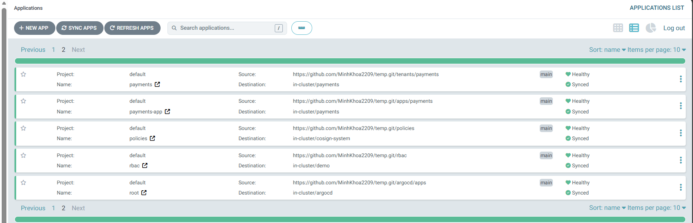
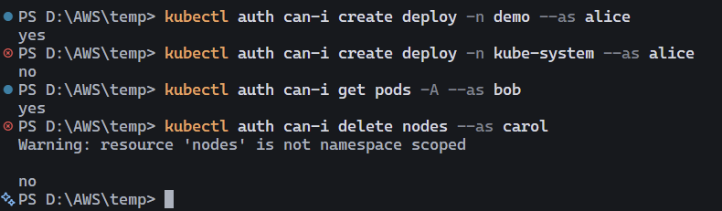
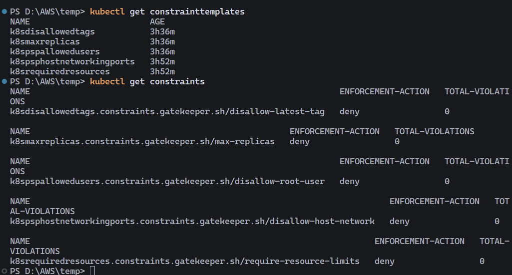
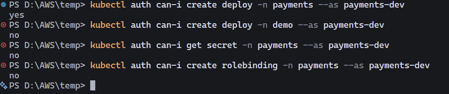
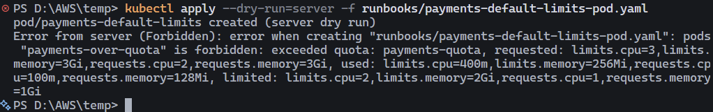
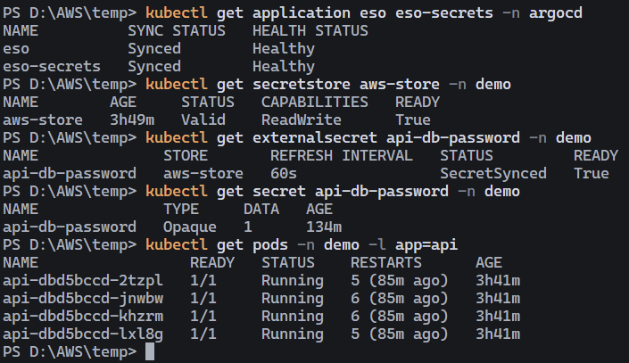

# W10 Lab Evidence Pack

Ngày chụp evidence: 2026-06-19

File này tổng hợp bằng chứng từ các screenshot trong thư mục `evidence/`. Các mục bên dưới chỉ kết luận những gì đã nhìn thấy trực tiếp từ ảnh.

## 1. Argo CD App of Apps và trạng thái GitOps

Screenshot hiển thị trang **Applications** của Argo CD, page 2, với các Application:

| Application | Source path | Destination | Health | Sync |
| --- | --- | --- | --- | --- |
| `payments` | `tenants/payments` | `in-cluster/payments` | Healthy | Synced |
| `payments-app` | `apps/payments` | `in-cluster/payments` | Healthy | Synced |
| `policies` | `policies` | `in-cluster/cosign-system` | Healthy | Synced |
| `rbac` | `rbac` | `in-cluster/demo` | Healthy | Synced |
| `root` | `argocd/apps` | `in-cluster/argocd` | Healthy | Synced |

Kết luận: các app GitOps quan trọng ở page này đã được Argo CD quản lý và đang ở trạng thái `Healthy` + `Synced`. Screenshot này chứng minh `root`, RBAC, tenant `payments`, workload `payments-app`, và supply-chain policy app đã sync thành công.

Lưu ý: ảnh này chỉ là page 2 của Argo CD. Nếu cần chứng minh toàn bộ Application W10, cần thêm screenshot page 1 hoặc output `kubectl get applications -n argocd`.

## 2. RBAC lab

Screenshot chạy các lệnh `kubectl auth can-i`:

| Check | Output | Ý nghĩa |
| --- | --- | --- |
| `alice` create deployment trong namespace `demo` | `yes` | Alice có quyền developer trong `demo`. |
| `alice` create deployment trong `kube-system` | `no` | Alice không vượt quyền sang namespace hệ thống. |
| `bob` get pods toàn cluster | `yes` | Bob có quyền SRE/view workload toàn cluster theo cấu hình lab. |
| `carol` delete nodes | `no` | Carol không có quyền thao tác destructive trên node. |

Kết luận: RBAC đạt yêu cầu least privilege. Alice chỉ có quyền trong phạm vi cần thiết, Bob có quyền xem/đọc workload, Carol không được phép xóa node.

## 3. Gatekeeper ConstraintTemplate và Constraint enforcement

Screenshot chứng minh Gatekeeper policy đã được cài:

- ConstraintTemplate đang tồn tại:
  - `k8sdisallowedtags`
  - `k8smaxreplicas`
  - `k8spspallowedusers`
  - `k8spsphostnetworkingports`
  - `k8srequiredresources`
- Các constraint đang ở `ENFORCEMENT-ACTION = deny`:
  - `disallow-latest-tag`
  - `max-replicas`
  - `disallow-root-user`
  - `disallow-host-network`
  - `require-resource-limits`

Kết luận: Gatekeeper admission guardrails đã được deploy và đang ở chế độ chặn thật (`deny`), không chỉ audit.

Lưu ý: screenshot này chưa có output reject từ `kubectl apply --dry-run=server -f runbooks/payments-violating-pod.yaml`. Nếu cần bằng chứng admission reject cho manifest vi phạm, cần thêm screenshot lệnh đó.

## 4. Tenant `payments` RBAC isolation

Screenshot kiểm tra quyền của user `payments-dev`:

| Check | Output | Ý nghĩa |
| --- | --- | --- |
| Create deployment trong namespace `payments` | `yes` | Team payments có thể tự quản workload của mình. |
| Create deployment trong namespace `demo` | `no` | Không được thao tác sang namespace team khác. |
| Get secret trong namespace `payments` | `no` | Không được đọc secret. |
| Create rolebinding trong namespace `payments` | `no` | Không được tự nâng quyền. |

Kết luận: tenant `payments` được cô lập đúng theo yêu cầu. User `payments-dev` chỉ có quyền vận hành workload trong namespace của team, không đọc secret, không tạo rolebinding, và không thao tác sang `demo`.

## 5. Tenant `payments` LimitRange và ResourceQuota

Screenshot chạy server dry-run cho `runbooks/payments-default-limits-pod.yaml`:

- Pod `payments-default-limits` được tạo thành công ở chế độ `server dry run`.
- Pod `payments-over-quota` bị Kubernetes API server từ chối với lỗi `Forbidden`.
- Lý do reject: vượt `ResourceQuota` `payments-quota`, trong đó requested CPU/memory lớn hơn hard limit của namespace.

Kết luận: LimitRange và ResourceQuota của namespace `payments` hoạt động đúng:

- Workload hợp lệ có thể được admit.
- Workload vượt quota bị reject trước khi chạy.

## 6. External Secrets Operator và secret sync

Screenshot kiểm tra External Secrets Operator:

| Resource | Output quan sát được |
| --- | --- |
| Argo CD Application `eso` | `Synced`, `Healthy` |
| Argo CD Application `eso-secrets` | `Synced`, `Healthy` |
| SecretStore `aws-store` namespace `demo` | `Valid`, `Ready=True` |
| ExternalSecret `api-db-password` namespace `demo` | `SecretSynced`, `Ready=True` |
| Kubernetes Secret `api-db-password` namespace `demo` | Type `Opaque`, `DATA=1` |
| API pods namespace `demo` | 4 pods `Running`, ready `1/1` |

Kết luận: ESO đã sync secret từ backend về Kubernetes Secret `api-db-password` trong namespace `demo`, và workload API đang chạy bình thường.

